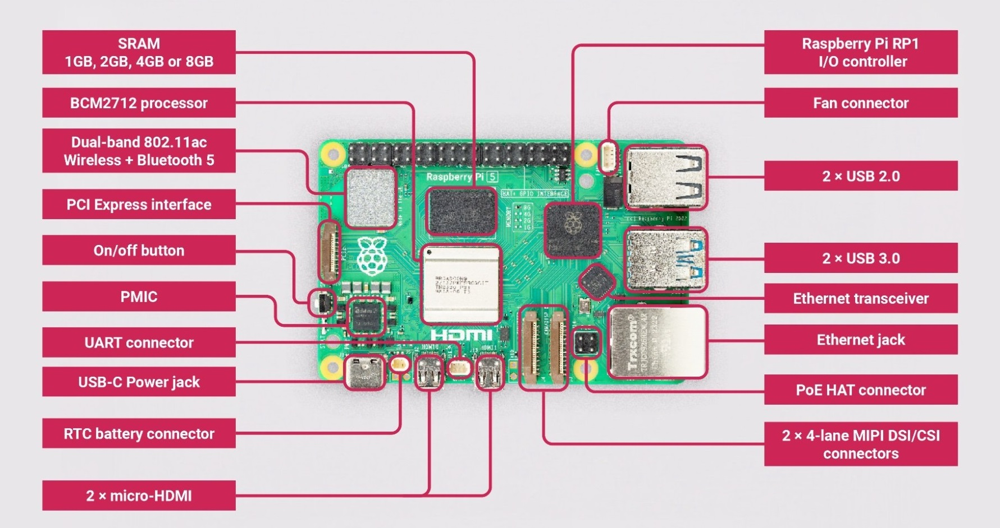
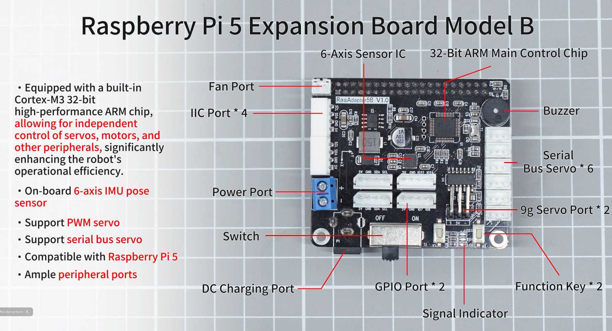
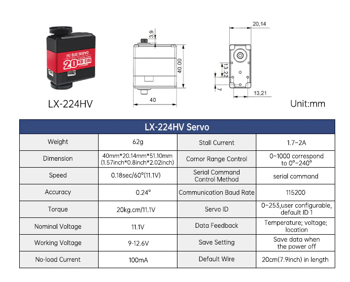
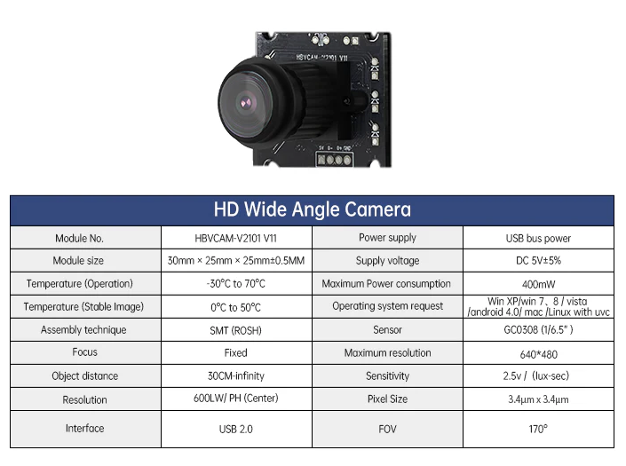

# Schildi_v2.0

This Python project is a newer robotic pet from Project called "Schildi_v1.0". The Base is a "Hiwonder SpiderPi Standard", equipped with clever sensors, it continuously scans its surroundings, processes data in real-time, and reacts completely autonomously with appropriate actions.

Here are the following Components:

----------------------------------------------------------
Raspberry Pi 5 4GB

Ports:
- 1x 40-Pin GPIO-Leiste
- 2x Micro-HDMI
- 1× USB-C (Stromversorgung)
- 2× USB 3.0 (blau)
- 2× USB 2.0
	- HD Wide Angle Camera HBVCAM-V2101 V11
	- youyeetoo LD19 LiDAR Kit - 12 Meter - 360 Grad - 30K Lux
- 1x Gigabit Ethernet (RJ45)
- 1x Fan Connector
- 1x PCIe Connector
- 1x ON/OFF Button
- 1x RTC Connector
- 1x UART Connector
- 2x MIPI DSI/CSI Connector
- 1x PoE+ HAT Connector
- 1x microSD-Karten-Slot

----------------------------------------------------------

Raspberry Pi 5 Expansion Board Model B

Internal:
- Cortex-M3 32-bit high-performance Arm chip
- 3-axis accelerator/ 3-axis gyroscope

Ports:

- 1x Fan Port
- 4x lane IIC Port
	- INA226 Spannungs Strom Modul über IIC-Leistungsüberwachung
	- Yahboom AI Voice Interaction Module
	- PCF8591 AD/DA Konverter Modul
		- 2x LED 
		- 1x Photoresistor LDR
		- 1x Thermistor: Zur Temperaturmessung.
 		- 1x Digital- und -Digital/Analog-Umsetzer mit vier Analogeingängen

- 2x lane GPIO Port
- 6x lane BUS Servo Port
- 2x lane PWM Servo Port
- 1x Buzzer
- 2x Function Key 
- 1x Power Port
- 1x DC Charging Port

----------------------------------------------------------
12x LX-224HV High Power Servos

----------------------------------------------------------

HBVCAM-V2101 HD Wide Angle Camera 

- 640x480 Resulution
- 400mW 5V
- USB 2.0

----------------------------------------------------------

Glowing Ultrasonic Sensor HW-SR06 
- 2mA
- 2-400cm Detection distance
- I2C communication

----------------------------------------------------------

Hiwonder Voltage Display Module Compatible with Hiwonder Robot
- <10mA
- Measuring range: 3 - 14 V
- Maximum input: 14V
- 3PIN Port

----------------------------------------------------------

Yahboom AI Voice Interaction Module
- I2C communication
- Serial Port
- Type C Port

----------------------------------------------------------

youyeetoo LD19 LiDAR Kit - 12 Meter - 360 Grad - 30K Lux
- 900 mW 5v
- USB 2.0

----------------------------------------------------------

What should the robot can do?

It should be able to walk.
- Walks with 6-port bus servo LX-224HV-Servos 

It should be able to monitor its own battery.
- Voltage will monitor with a INA226 voltage/current module (I2C power monitoring)

It should have a camera.
- HD Wide-Angle Camera (HBVCAM-V2101 V11)

It should be able to converse with People.
- Yahboom AI Voice Interaction Module

It should be able to perceive its surroundings.
- Glowing Ultrasonic Sensor (HW-SR06)
	or
- youyeetoo LD19 LiDAR Kit (12-meter range, 360-degree view, 30k lux)

----------------------------------------------------------

Other exciting modules?

- Google Coral USB Accelerator or Intel Neural Compute Stick 2
- USB 3.0 SSD
- BME280 (temperature, air pressure, humidity)

